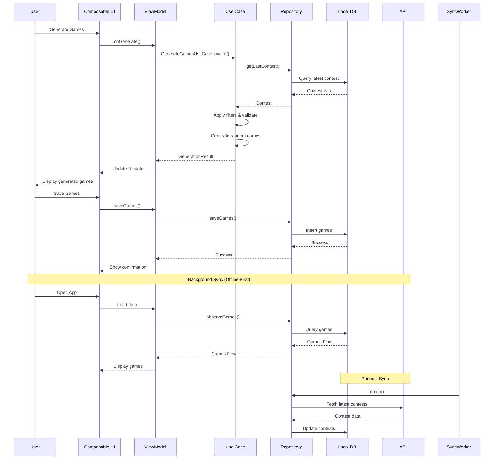

# Cebolão (Loto Generator) - Architecture Diagram

## Project Overview

This is an Android native app for generating, filtering, and checking lottery games from CAIXA. Built with Kotlin, Jetpack Compose, and follows Clean Architecture + MVVM pattern with Offline-First approach.

## Architecture Diagram

```mermaid
graph TB
    subgraph "Presentation Layer (UI)"
        MainActivity[MainActivity]
        CebolaoApp[CebolaoApp]
        MainViewModel[MainViewModel]
        
        subgraph "Navigation"
            CebolaoNavHost[CebolaoNavHost]
            Route[Route]
        end
        
        subgraph "Features"
            HomeScreen[HomeScreen]
            HomeViewModel[HomeViewModel]
            
            GeneratorScreen[GeneratorScreen]
            GeneratorViewModel[GeneratorViewModel]
            
            CheckerScreen[CheckerScreen]
            CheckerViewModel[CheckerViewModel]
            
            GamesScreen[GamesScreen]
            GamesViewModel[GamesViewModel]
            
            AboutScreen[AboutScreen]
            AboutViewModel[AboutViewModel]
            
            StatisticsScreen[StatisticsScreen]
            StatisticsViewModel[StatisticsViewModel]
            
            OnboardScreen[OnboardScreen]
        end
        
        subgraph "UI Components"
            LotteryCard[LotteryCard]
            LotteryBalls[LotteryBalls]
            CebolaoTopAppBar[CebolaoTopAppBar]
            GameDetailsDialog[GameDetailsDialog]
            AppDialogs[AppDialogs]
            StateComponents[StateComponents]
            WelcomeBanner[WelcomeBanner]
            SuperSeteInput[SuperSeteInput]
            TeamSelectionDialog[TeamSelectionDialog]
        end
    end
    
    subgraph "Domain Layer (Business Logic)"
        subgraph "Models"
            Game[Game]
            Contest[Contest]
            LotteryType[LotteryType]
            LotteryProfile[LotteryProfile]
            LotteryInfo[LotteryInfo]
            GenerationConfig[GenerationConfig]
            GenerationFilter[GenerationFilter]
            FilterConfig[FilterConfig]
            FilterPreset[FilterPreset]
            GenerationReport[GenerationReport]
            CheckResult[CheckResult]
            Statistics[Statistics]
            UserFilterPreset[UserFilterPreset]
            UserUsageStats[UserUsageStats]
        end
        
        subgraph "Use Cases"
            GenerateGamesUseCase[GenerateGamesUseCase]
            CheckGameUseCase[CheckGameUseCase]
            CalculateStatisticsUseCase[CalculateStatisticsUseCase]
        end
        
        subgraph "Services"
            GameValidator[GameValidator]
        end
        
        subgraph "Repositories (Interfaces)"
            LotteryRepository[LotteryRepository]
            SettingsRepository[SettingsRepository]
            ProfileRepository[ProfileRepository]
            UserPresetRepository[UserPresetRepository]
            UserStatisticsRepository[UserStatisticsRepository]
        end
        
        subgraph "Rules"
            LotteryRules[LotteryRules]
        end
    end
    
    subgraph "Data Layer (Infrastructure)"
        subgraph "Repository Implementations"
            LotteryRepositoryImpl[LotteryRepositoryImpl]
            SettingsRepositoryImpl[SettingsRepositoryImpl]
            ProfileRepositoryImpl[ProfileRepositoryImpl]
            UserStatisticsRepositoryImpl[UserStatisticsRepositoryImpl]
        end
        
        subgraph "Local Storage"
            LotteryDatabase[LotteryDatabase]
            LotteryDao[LotteryDao]
            ContestEntity[ContestEntity]
            GameEntity[GameEntity]
            JsonFileStore[JsonFileStore]
            UserPresetDataStoreRepository[UserPresetDataStoreRepository]
            AssetsReader[AssetsReader]
        end
        
        subgraph "Remote Data"
            LotteryApi[LotteryApi]
            ContestDto[ContestDto]
            ContestMapper[ContestMapper]
            GameMapper[GameMapper]
        end
        
        subgraph "Workers & Initialization"
            DataInitializer[DataInitializer]
            WorkScheduler[WorkScheduler]
            SyncWorker[SyncWorker]
        end
    end
    
    subgraph "Dependency Injection"
        DataModule[DataModule]
        NetworkModule[NetworkModule]
        CoroutinesModule[CoroutinesModule]
    end
    
    subgraph "Application"
        CebolaoApplication[CebolaoApplication]
        HiltAndroidApp[HiltAndroidApp]
    end
    
    %% Navigation Flow
    MainActivity --> CebolaoApp
    CebolaoApp --> CebolaoNavHost
    MainViewModel --> Route
    
    CebolaoNavHost --> HomeScreen
    CebolaoNavHost --> GeneratorScreen
    CebolaoNavHost --> CheckerScreen
    CebolaoNavHost --> GamesScreen
    CebolaoNavHost --> AboutScreen
    CebolaoNavHost --> StatisticsScreen
    CebolaoNavHost --> OnboardScreen
    
    %% Feature Connections
    HomeScreen --> HomeViewModel
    GeneratorScreen --> GeneratorViewModel
    CheckerScreen --> CheckerViewModel
    GamesScreen --> GamesViewModel
    AboutScreen --> AboutViewModel
    StatisticsScreen --> StatisticsViewModel
    
    %% ViewModel to Use Case Connections
    GeneratorViewModel --> GenerateGamesUseCase
    CheckerViewModel --> CheckGameUseCase
    StatisticsViewModel --> CalculateStatisticsUseCase
    HomeViewModel --> LotteryRepository
    
    %% Use Case to Service Connections
    GenerateGamesUseCase --> GameValidator
    CheckGameUseCase --> LotteryRules
    
    %% Use Case to Repository Connections
    GenerateGamesUseCase --> LotteryRepository
    CheckGameUseCase --> LotteryRepository
    CalculateStatisticsUseCase --> LotteryRepository
    
    %% Repository to Implementation Connections
    LotteryRepository -.->|interface| LotteryRepositoryImpl
    SettingsRepository -.->|interface| SettingsRepositoryImpl
    ProfileRepository -.->|interface| ProfileRepositoryImpl
    UserPresetRepository -.->|interface| UserPresetDataStoreRepository
    UserStatisticsRepository -.->|interface| UserStatisticsRepositoryImpl
    
    %% Repository Implementation to Data Sources
    LotteryRepositoryImpl --> LotteryDao
    LotteryRepositoryImpl --> LotteryApi
    LotteryRepositoryImpl --> JsonFileStore
    LotteryRepositoryImpl --> AssetsReader
    
    SettingsRepositoryImpl --> UserPresetDataStoreRepository
    ProfileRepositoryImpl --> LotteryInfo
    
    %% Local Storage
    LotteryDao --> LotteryDatabase
    LotteryDatabase --> ContestEntity
    LotteryDatabase --> GameEntity
    
    %% Remote Data
    LotteryApi --> ContestDto
    LotteryRepositoryImpl --> ContestMapper
    LotteryRepositoryImpl --> GameMapper
    
    %% Workers
    CebolaoApplication --> DataInitializer
    CebolaoApplication --> WorkScheduler
    WorkScheduler --> SyncWorker
    SyncWorker --> LotteryRepositoryImpl
    
    %% Dependency Injection
    DataModule --> LotteryDatabase
    DataModule --> LotteryDao
    DataModule --> LotteryRepositoryImpl
    NetworkModule --> LotteryApi
    CoroutinesModule --> CoroutineDispatchers
    
    %% Application Setup
    CebolaoApplication --> HiltAndroidApp
    CebolaoApplication --> DataModule
    CebolaoApplication --> NetworkModule
    CebolaoApplication --> CoroutinesModule
    
    %% UI Components Usage
    GeneratorScreen --> LotteryCard
    GeneratorScreen --> LotteryBalls
    GeneratorScreen --> AppDialogs
    CheckerScreen --> LotteryBalls
    CheckerScreen --> GameDetailsDialog
    HomeScreen --> LotteryCard
    HomeScreen --> WelcomeBanner
    GamesScreen --> LotteryCard
    GamesScreen --> LotteryBalls
    
    %% Styling
    CebolaoApp --> CebolaoTopAppBar
```



## Data Flow Diagram



## Component Relationships

```mermaid
erDiagram
    GAME ||--o{ FILTER_PRESET : "uses"
    GAME ||--|| LOTTERY_TYPE : "belongs to"
    CONTEST ||--|| LOTTERY_TYPE : "belongs to"
    CONTEST ||--o{ GAME : "checks against"
    LOTTERY_PROFILE ||--|| LOTTERY_TYPE : "defines"
    LOTTERY_PROFILE ||--o{ GENERATION_FILTER : "supports"
    GENERATION_CONFIG ||--o{ GENERATION_FILTER : "contains"
    GENERATION_CONFIG ||--|| LOTTERY_PROFILE : "uses"
    USER_FILTER_PRESET ||--o{ GENERATION_CONFIG : "stores"
    USER_FILTER_PRESET ||--|| LOTTERY_TYPE : "for"
    
    GAME {
        string id PK
        lottery_type FK
        numbers List<Int>
        team_number Int?
        created_at Long
        is_pinned Boolean
    }
    
    CONTEST {
        string id PK
        lottery_type FK
        contest_number Int
        numbers List<Int>
        date String
        next_contest String?
    }
    
    LOTTERY_TYPE {
        enum values
        MEGA_SENA
        LOTOFACIL
        QUINA
        LOTOMANIA
        DUPLA_SENA
        TIMEMANIA
        SUPER_SETE
    }
    
    LOTTERY_PROFILE {
        lottery_type PK
        min_number Int
        max_number Int
        numbers_per_game Int
        has_team Boolean
        team_range Pair<Int,Int>?
        is_super_sete Boolean
    }
    
    GENERATION_FILTER {
        enum values
        PARITY_BALANCE
        MULTIPLES_OF_3
        REPEATED_FROM_PREVIOUS
        MOLDURA_MIOLO
        PRIME_NUMBERS
    }
    
    USER_FILTER_PRESET {
        string name PK
        lottery_type FK
        generation_config JSON
        usage_count Int
        last_used_at Long
    }
```

## Key Architecture Principles

### 1. Clean Architecture
- **Domain Layer**: Pure Kotlin with no Android dependencies
- **Data Layer**: Infrastructure for persistence and networking
- **Presentation Layer**: Compose UI with ViewModels

### 2. Offline-First
- Local Room database as primary data source
- WorkManager for background synchronization
- Assets for initial data seeding
- Fallback to legacy JSON migration

### 3. MVVM Pattern
- ViewModels manage UI state
- Compose observes StateFlow/Flow
- Unidirectional data flow

### 4. Dependency Injection
- Hilt for compile-time DI
- Module-based organization (Data, Network, Coroutines)
- Singleton repositories

### 5. Reactive Programming
- Flow for reactive data streams
- StateFlow for UI state
- Coroutines for async operations

## Module Structure

```
com.cebolao
├── app/                    # Presentation Layer
│   ├── MainActivity
│   ├── MainViewModel
│   ├── navigation/         # Navigation Compose
│   ├── feature/            # Feature screens & ViewModels
│   │   ├── home/
│   │   ├── generator/
│   │   ├── checker/
│   │   ├── games/
│   │   ├── about/
│   │   ├── statistics/
│   │   └── onboarding/
│   ├── component/          # Reusable UI components
│   ├── theme/             # Material 3 theme
│   ├── ui/                # Root composables
│   ├── util/              # UI utilities
│   └── di/                # Hilt modules
│
├── domain/                 # Domain Layer (Business Logic)
│   ├── model/             # Domain models
│   ├── repository/        # Repository interfaces
│   ├── usecase/           # Use cases
│   ├── service/           # Domain services
│   ├── rules/             # Lottery-specific rules
│   ├── result/            # Result wrapper types
│   ├── error/             # Error types
│   └── util/              # Domain utilities
│
└── data/                  # Data Layer (Infrastructure)
    ├── repository/        # Repository implementations
    ├── local/             # Local storage
    │   ├── room/          # Room database
    │   │   ├── dao/
    │   │   ├── entity/
    │   │   └── LotteryDatabase
    │   ├── AssetsReader   # Asset loading
    │   └── JsonFileStore  # Legacy migration
    ├── remote/            # Remote API
    │   ├── api/
    │   ├── dto/
    │   └── mapper/
    ├── worker/            # WorkManager workers
    └── initializer/       # Data initialization
```

## Technology Stack

- **Language**: Kotlin
- **UI Framework**: Jetpack Compose (Material 3)
- **Architecture**: Clean Architecture + MVVM
- **DI**: Hilt
- **Concurrency**: Coroutines & Flow
- **Database**: Room
- **Networking**: Retrofit (implied)
- **Background Jobs**: WorkManager
- **Navigation**: Navigation Compose (type-safe)
- **Build**: Gradle Kotlin DSL
