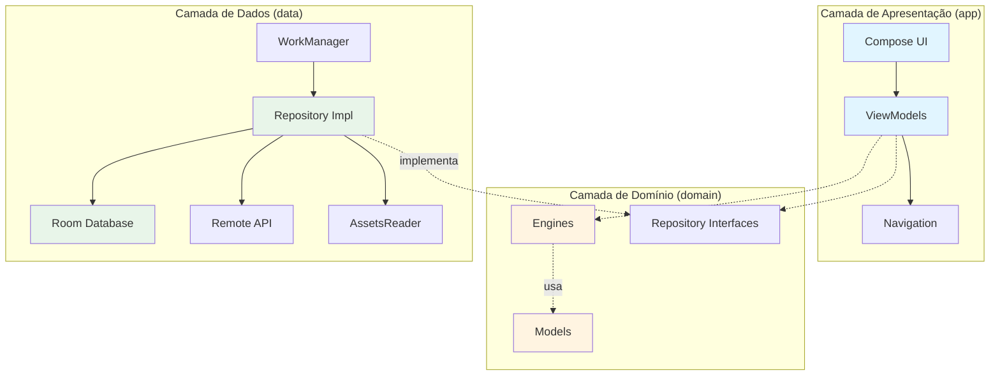
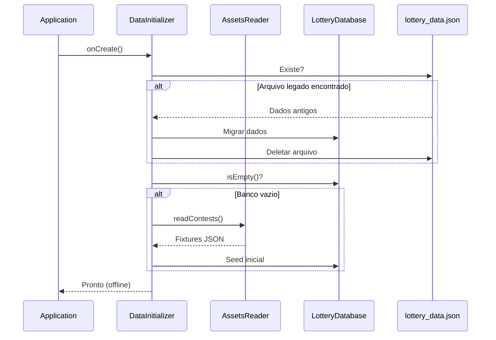
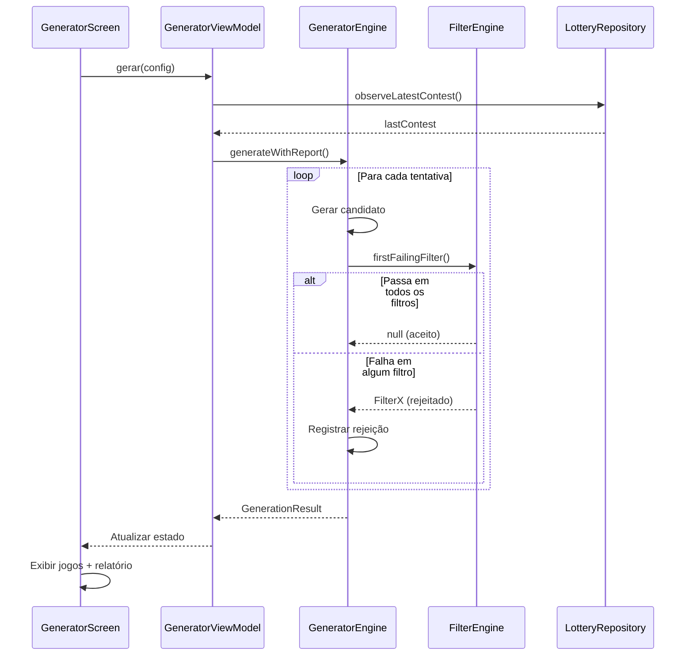
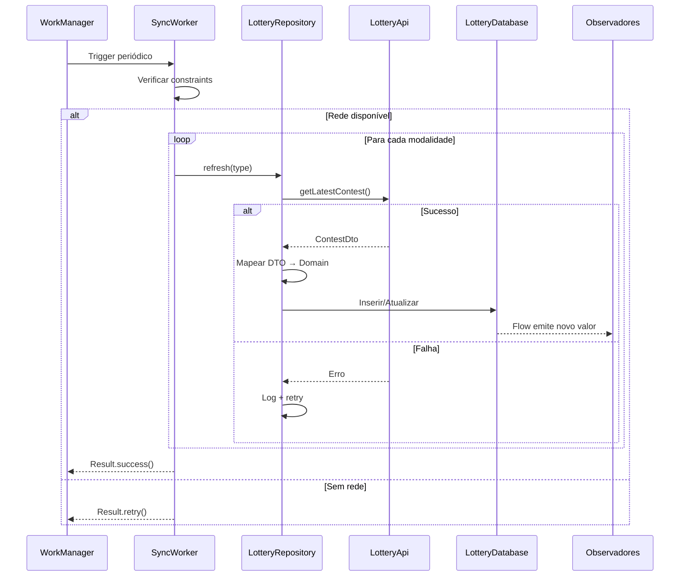
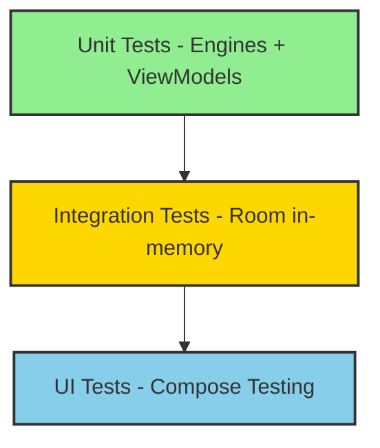

# Arquitetura do Sistema

## Visão Geral

O projeto segue **Clean Architecture + MVVM**, com separação clara entre camadas de domínio, dados e apresentação. A arquitetura prioriza testabilidade, manutenibilidade e separação de responsabilidades.



### Princípios Arquiteturais

- **domain**: Regras de negócio puras, sem dependências Android (Kotlin puro)
- **data**: Persistência local (Room), sincronização remota (Retrofit) e seed de dados
- **app**: UI (Jetpack Compose), navegação, ViewModels e injeção de dependências

O objetivo é manter a lógica de cada modalidade isolada e validada por **LotteryProfile**, garantindo consistência e facilidade de testes.

## Camadas e Responsabilidades

### Domain — Lógica de Negócio Pura

**Localização:** `app/src/main/java/com/cebolao/domain`

#### Modelos de Dados
- [`LotteryProfile`](file:///c:/Users/bsbpl/Desktop/Plinio/Projetos/loto-generator/app/src/main/java/com/cebolao/domain/model/LotteryProfile.kt) — Fonte de verdade para características de cada modalidade
- [`Contest`](file:///c:/Users/bsbpl/Desktop/Plinio/Projetos/loto-generator/app/src/main/java/com/cebolao/domain/model/Contest.kt) — Representa um concurso/sorteio oficial
- [`Game`](file:///c:/Users/bsbpl/Desktop/Plinio/Projetos/loto-generator/app/src/main/java/com/cebolao/domain/model/Game.kt) — Representa um jogo do usuário
- [`GenerationConfig`](file:///c:/Users/bsbpl/Desktop/Plinio/Projetos/loto-generator/app/src/main/java/com/cebolao/domain/model/GenerationConfig.kt) — Configuração de geração (filtros, presets)
- `CheckResult` — Resultado de conferência com prêmios
- `GenerationReport` — Métricas detalhadas de geração

#### Engines — Lógica Central

**[`GeneratorEngine`](file:///c:/Users/bsbpl/Desktop/Plinio/Projetos/loto-generator/app/src/main/java/com/cebolao/domain/engine/GeneratorEngine.kt)**
- Geração aleatória de jogos com validação de regras
- Suporte a números fixos e Time do Coração (Timemania)
- Geração posicional para Super Sete (7 colunas × 0-9)
- Relatórios detalhados com breakdown de rejeições por filtro
- Fonte de aleatoriedade injetável para testes determinísticos

**[`FilterEngine`](file:///c:/Users/bsbpl/Desktop/Plinio/Projetos/loto-generator/app/src/main/java/com/cebolao/domain/engine/FilterEngine.kt)**
- Validação estatística configurável
- Filtros: paridade, múltiplos de 3, números primos, moldura/miolo, repetições
- Lógica de aplicabilidade por modalidade (ex: moldura/miolo apenas Lotofácil)
- Configuração parametrizável (limiares min/max)

**[`CheckerEngine`](file:///c:/Users/bsbpl/Desktop/Plinio/Projetos/loto-generator/app/src/main/java/com/cebolao/domain/engine/CheckerEngine.kt)**
- Conferência de jogos contra resultados oficiais
- **Dupla Sena**: 3 modos (1º sorteio, 2º sorteio, melhor dos dois)
- **Timemania**: Verificação de acerto do Time do Coração
- **Super Sete**: Comparação posicional coluna por coluna
- Cálculo de faixas de premiação por modalidade

**[`StatisticsEngine`](file:///c:/Users/bsbpl/Desktop/Plinio/Projetos/loto-generator/app/src/main/java/com/cebolao/domain/engine/StatisticsEngine.kt)**
- Análise de frequência de números
- Estatísticas por modalidade
- Histórico de aparições

#### Regras Especiais por Modalidade

| Modalidade     | Peculiaridades                              |
|----------------|---------------------------------------------|
| **Super Sete** | Seleção posicional (7 colunas, dígitos 0-9) |
| **Dupla Sena** | Dupla apuração (1º e 2º sorteios)           |
| **Timemania**  | 10 números + Time do Coração (1-80)         |
| **Lotomania**  | 50 números, premiação com 0 acertos         |
| **Lotofácil**  | Filtro específico moldura/miolo (grid 5×5)  |

### Data — Persistência e Sincronização

**Localização:** `app/src/main/java/com/cebolao/data`

#### Camada Local

**[`AssetsReader`](file:///c:/Users/bsbpl/Desktop/Plinio/Projetos/loto-generator/app/src/main/java/com/cebolao/data/local/AssetsReader.kt)**
- Leitura de fixtures JSON iniciais (`assets/*.json`)
- Suporte a schema versionado (`schemaVersion` + `contests`)
- Validação e fallback para formatos legados
- Profiles definidos em código (em memória)

**Room Database**
- [`LotteryDatabase`](file:///c:/Users/bsbpl/Desktop/Plinio/Projetos/loto-generator/app/src/main/java/com/cebolao/data/local/room/LotteryDatabase.kt) — Banco SQLite local
- [`LotteryDao`](file:///c:/Users/bsbpl/Desktop/Plinio/Projetos/loto-generator/app/src/main/java/com/cebolao/data/local/room/dao/LotteryDao.kt) — Queries com suporte a Flows reativos
- [`ContestEntity`](file:///c:/Users/bsbpl/Desktop/Plinio/Projetos/loto-generator/app/src/main/java/com/cebolao/data/local/room/entity/ContestEntity.kt), [`GameEntity`](file:///c:/Users/bsbpl/Desktop/Plinio/Projetos/loto-generator/app/src/main/java/com/cebolao/data/local/room/entity/GameEntity.kt) — Entidades persistidas
- [`Converters`](file:///c:/Users/bsbpl/Desktop/Plinio/Projetos/loto-generator/app/src/main/java/com/cebolao/data/local/room/Converters.kt) — Conversores de tipos complexos (List, LocalDateTime)

**[`JsonFileStore`](file:///c:/Users/bsbpl/Desktop/Plinio/Projetos/loto-generator/app/src/main/java/com/cebolao/data/local/JsonFileStore.kt)** (Legado)
- Persistência em `lottery_data.json` (versões antigas)
- Utilizado apenas para migração automática no startup

#### Camada Remota

**[`LotteryApi`](file:///c:/Users/bsbpl/Desktop/Plinio/Projetos/loto-generator/app/src/main/java/com/cebolao/data/remote/api/LotteryApi.kt)**
- Endpoints REST para resultados oficiais
- Retrofit + Moshi para serialização

**Mappers**
- [`ContestMapper`](file:///c:/Users/bsbpl/Desktop/Plinio/Projetos/loto-generator/app/src/main/java/com/cebolao/data/remote/mapper/ContestMapper.kt) — DTO ↔ Domínio ↔ Entity
- [`GameMapper`](file:///c:/Users/bsbpl/Desktop/Plinio/Projetos/loto-generator/app/src/main/java/com/cebolao/data/remote/mapper/GameMapper.kt) — Game ↔ GameEntity

#### Repositórios

**[`LotteryRepositoryImpl`](file:///c:/Users/bsbpl/Desktop/Plinio/Projetos/loto-generator/app/src/main/java/com/cebolao/data/repository/LotteryRepositoryImpl.kt)**
- Room como **fonte de verdade** (single source of truth)
- Padrão Stale-While-Revalidate (SWR): servir cache + atualizar em background
- Flows reativos para mudanças de dados
- Métodos:
  - `observeContests(type)` — Flow de concursos por modalidade
  - `observeLatestContest(type)` — Flow do último concurso
  - `observeGames()` / `observeGamesByType(type)` — Flow de jogos salvos
  - `refresh(type)` — Sincronização manual/automática

**[`ProfileRepositoryImpl`](file:///c:/Users/bsbpl/Desktop/Plinio/Projetos/loto-generator/app/src/main/java/com/cebolao/data/repository/ProfileRepositoryImpl.kt)**
- Profiles definidos em código via `AssetsReader`
- Cache em memória para performance

**[`UserPresetDataStoreRepository`](file:///c:/Users/bsbpl/Desktop/Plinio/Projetos/loto-generator/app/src/main/java/com/cebolao/data/local/UserPresetDataStoreRepository.kt)**
- Presets personalizados do usuário
- Persistência com DataStore (Preferences)

#### Sincronização em Background

**[`SyncWorker`](file:///c:/Users/bsbpl/Desktop/Plinio/Projetos/loto-generator/app/src/main/java/com/cebolao/data/worker/SyncWorker.kt)**
- Worker periódico para sincronização automática
- Constraints: rede disponível, bateria não crítica
- Retry automático com backoff exponencial

**[`WorkScheduler`](file:///c:/Users/bsbpl/Desktop/Plinio/Projetos/loto-generator/app/src/main/java/com/cebolao/data/worker/WorkScheduler.kt)**
- Agenda sincronização periódica (diária)
- Cancela/reagenda conforme necessário

### App — Apresentação e Navegação

**Localização:** `app/src/main/java/com/cebolao/app`

#### Interface do Usuário (Jetpack Compose)

**Design System**
- Material Design 3 com suporte a Dark Mode
- [`Color.kt`](file:///c:/Users/bsbpl/Desktop/Plinio/Projetos/loto-generator/app/src/main/java/com/cebolao/app/theme/Color.kt), [`Type.kt`](file:///c:/Users/bsbpl/Desktop/Plinio/Projetos/loto-generator/app/src/main/java/com/cebolao/app/theme/Type.kt), [`Shape.kt`](file:///c:/Users/bsbpl/Desktop/Plinio/Projetos/loto-generator/app/src/main/java/com/cebolao/app/theme/Shape.kt) — Tokens do design system
- [`LotteryColors`](file:///c:/Users/bsbpl/Desktop/Plinio/Projetos/loto-generator/app/src/main/java/com/cebolao/app/ui/LotteryColors.kt) — Cores por modalidade (seguindo manual CAIXA)

**Componentes Reutilizáveis**
- [`LotteryBalls`](file:///c:/Users/bsbpl/Desktop/Plinio/Projetos/loto-generator/app/src/main/java/com/cebolao/app/component/LotteryBalls.kt) — Visualização de números
- [`LotteryCard`](file:///c:/Users/bsbpl/Desktop/Plinio/Projetos/loto-generator/app/src/main/java/com/cebolao/app/component/LotteryCard.kt) — Card de modalidade
- [`SuperSeteInput`](file:///c:/Users/bsbpl/Desktop/Plinio/Projetos/loto-generator/app/src/main/java/com/cebolao/app/component/SuperSeteInput.kt) — Seleção por colunas
- [`TeamSelectionDialog`](file:///c:/Users/bsbpl/Desktop/Plinio/Projetos/loto-generator/app/src/main/java/com/cebolao/app/component/TeamSelectionDialog.kt) — Escolha de time (Timemania)

**Features** (Telas + ViewModels)
- `feature/home` — HomeScreen + HomeViewModel
- `feature/generator` — GeneratorScreen + GeneratorViewModel
- `feature/checker` — CheckerScreen + CheckerViewModel
- `feature/games` — GamesScreen + GamesViewModel
- `feature/about` — AboutScreen + AboutViewModel
- `feature/onboarding` — OnboardingScreen + OnboardViewModel

#### ViewModels e Estado

**Padrão de Estado Único**
```kotlin
data class UiState(
    val isLoading: Boolean = false,
    val data: T? = null,
    val error: AppError? = null
)

class FeatureViewModel : ViewModel() {
    private val _state = MutableStateFlow(UiState())
    val state: StateFlow<UiState> = _state.asStateFlow()
}
```

- Estado via `StateFlow` (reativo)
- Conversão de dados de domínio para UI state
- Coleta lifecycle-aware na UI (`collectAsStateWithLifecycle`)

#### Navegação

- [`CebolaoNavigation`](file:///c:/Users/bsbpl/Desktop/Plinio/Projetos/loto-generator/app/src/main/java/com/cebolao/app/navigation/CebolaoNavigation.kt) — NavHost type-safe
- [`Route`](file:///c:/Users/bsbpl/Desktop/Plinio/Projetos/loto-generator/app/src/main/java/com/cebolao/app/navigation/Route.kt) — Rotas seladas
- [`BottomNavigationBar`](file:///c:/Users/bsbpl/Desktop/Plinio/Projetos/loto-generator/app/src/main/java/com/cebolao/app/navigation/BottomNavigationBar.kt) — Navegação principal

#### Injeção de Dependências (Hilt)

- [`DataModule`](file:///c:/Users/bsbpl/Desktop/Plinio/Projetos/loto-generator/app/src/main/java/com/cebolao/app/di/DataModule.kt) — Repositórios, Room, DataStore
- [`NetworkModule`](file:///c:/Users/bsbpl/Desktop/Plinio/Projetos/loto-generator/app/src/main/java/com/cebolao/app/di/NetworkModule.kt) — Retrofit, OkHttp
- [`CoroutinesModule`](file:///c:/Users/bsbpl/Desktop/Plinio/Projetos/loto-generator/app/src/main/java/com/cebolao/app/di/CoroutinesModule.kt) — Dispatchers e scopes

#### Recursos

- `res/values/strings.xml` — **100% dos textos em PT-BR**
- `res/values/dimens.xml` — Dimensões e espaçamentos
- `res/values-night/` — Valores para dark mode

## Fluxos principais

### Inicialização
1. `DataInitializer` tenta migrar `lottery_data.json` (legado) para o Room, se existir.
2. Em instalações novas (Room vazio), faz seed dos concursos a partir dos assets.
3. O app inicia offline-first sem depender de rede.

### Geração de jogos
1. `GeneratorViewModel` monta `GenerationConfig`.
2. `GeneratorEngine` gera jogos com filtros e relatório.
3. UI exibe resultados e relatório quando parcial.

### Conferência
1. Usuário escolhe números/time.
2. `CheckerEngine` valida com `Contest` mais recente.
3. Resultado inclui faixa, acertos e acerto do time (Timemania).

### Sincronização
1. `WorkScheduler` agenda `SyncWorker`.
2. `LotteryRepository.refresh` busca concursos recentes.
3. Dados são mesclados e persistidos sem bloquear UI.

---

## Fluxo de Dados Detalhado

### Startup e Seed Inicial



### Geração de Jogos com Filtros



### Sincronização em Background



---

## Tratamento de Erros

### Hierarquia de Erros

```kotlin
sealed class AppError {
    data class NetworkError(val message: String) : AppError()
    data class DatabaseError(val message: String) : AppError()
    data class ValidationError(val message: String) : AppError()
    data class ParseError(val message: String) : AppError()
    data class UnknownError(val throwable: Throwable) : AppError()
}
```

### Estratégia por Camada

#### Domain
- **Validações explícitas** com `require()` e `check()`
- Exceções customizadas apenas para casos excepcionais
- Retorno de tipos selados quando apropriado

#### Data
- **Repositórios**: Retornam `Flow<List<T>>` para dados ou `Result<T>` para operações
- **Network**: Erros de rede são capturados e convertidos em `AppError.NetworkError`
- **Database**: Falhas de Room são logadas e não crasheiam o app
- **Assets**: Erros de parse em prod são logados; em debug lançam exceção

#### App (UI)
- ViewModels expõem erros via `UiState.error: AppError?`
- UI exibe mensagens amigáveis em PT-BR
- Ações de retry quando aplicável
- Logs para rastreamento (quando integração de analytics estiver disponível)

---

## Estratégia de Testes

### Pirâmide de Testes



### Cobertura Atual e Metas

| Camada                | Cobertura Atual | Meta | Prioridade |
|-----------------------|-----------------|------|------------|
| **Domain Engines**    | ~80%            | 90%+ | ⭐⭐⭐        |
| **Domain Models**     | ~60%            | 85%+ | ⭐⭐⭐        |
| **Data Repositories** | ~40%            | 75%+ | ⭐⭐         |
| **ViewModels**        | ~50%            | 80%+ | ⭐⭐         |
| **UI Components**     | ~10%            | 50%+ | ⭐          |

### Testes Unitários (Domain)

**Engines**
- ✅ `GeneratorEngineTest` — geração básica, com filtros, relatórios
- ✅ `GeneratorEngineReportTest` — métricas detalhadas
- ✅ `CheckerEngineTest` — conferência para todas modalidades
- ✅ `FilterEngineTest` — validação de filtros
- ✅ `FilterEngineConfigTest` — configurações parametrizáveis

**Abordagem:**
- Testes parametrizados para cobrir todas as modalidades
- Injeção de `Random` com seed fixo para determinismo
- Fixtures reais de concursos quando aplicável

### Testes de Integração (Data)

**Repositórios**
- ✅ `LotteryRepositoryImplTest` — CRUD e flows com Room in-memory
- ✅ `AssetsReaderTest` — parse de JSONs com schemas variados

**Pendentes:**
- ProfileRepository com cache
- UserPresetDataStore com DataStore de teste
- Mappers (DTO ↔ Domain ↔ Entity)

### Testes de UI (App)

**Pendentes (prioridade média):**
- HomeScreen — rendering de cards por modalidade
- GeneratorScreen — configuração de filtros e presets
- CheckerScreen — validação de seleção e resultado

**Ferramentas:**
- Compose Testing (ComposeTestRule)
- Turbine para testar Flows
- MockK para mocking de repositórios

---

## Convenções de Nomenclatura

### Arquivos e Classes
- **Modelos**: Substantivos em singular (ex: `LotteryProfile`, `Contest`)
- **Engines**: Substantivo + "Engine" (ex: `GeneratorEngine`)
- **Repositories**: Interface sem sufixo, Impl com "Impl" (ex: `LotteryRepository`, `LotteryRepositoryImpl`)
- **ViewModels**: Feature + "ViewModel" (ex: `GeneratorViewModel`)
- **Screens**: Feature + "Screen" (ex: `GeneratorScreen`)
- **Composables**: PascalCase descritivo (ex: `LotteryBalls`, `TeamSelectionDialog`)

### Pacotes
- `domain.model` — modelos de dados
- `domain.engine` — lógica de negócio
- `domain.repository` — interfaces de repositório
- `data.local` — persistência local
- `data.remote` — API e rede
- `data.repository` — implementações de repositório
- `app.feature.<nome>` — telas e ViewModels
- `app.component` — componentes reutilizáveis
- `app.theme` — design system

---

## Considerações de Performance

### Otimizações Aplicadas

✅ **Startup**
- Seed de dados em background (DataInitializer)
- Inicialização lazy de singletons (Hilt)
- Migrations fora da thread principal

✅ **UI (Compose)**
- `collectAsStateWithLifecycle` para evitar work desnecessário
- `remember` para cálculos custosos
- Componentes stateless quando possível

✅ **Database**
- Flows reativos para evitar polling
- Índices em colunas frequentemente consultadas
- Batch inserts para seed inicial

✅ **Sincronização**
- WorkManager com constraints adequados
- Backoff exponencial em falhas
- Sincronização não bloqueia UI

### Roadmap de Performance

⏳ **Futuro**
- Baseline Profiles para melhorar startup em produção
- Macrobenchmark para medir startup e jank
- `derivedStateOf` para cálculos derivados em composables
- Paginação de lista de jogos (quando volume crescer)

---

## Considerações de Escalabilidade

### Modularização Futura

Quando o projeto crescer, evoluir para estrutura multi-módulo:

```
:app (application module)
  └─ :feature:home
  └─ :feature:generator
  └─ :feature:checker
  └─ :core:ui (design system)
  └─ :core:data (repositories impl)
  └─ :core:domain (engines, models)
```

**Benefícios:**
- Build paralelo e incremental mais rápido
- Separação clara de responsabilidades
- Possibilidade de feature modules dinâmicos
- Enforcing de limites de camada via Gradle

### Use Cases

Para orquestração complexa, introduzir use cases:
- `GenerateGamesUseCase`
- `CheckGameUseCase`
- `SyncAllContestsUseCase`

### Cache Remoto

- Controle de staleness por modalidade
- Política de evicção de concursos antigos
- Compressão de dados quando necessário

### Migração de Schema

- Versionamento explícito de assets JSON
- Room migrations testadas
- Rollback strategy para falhas de migração
